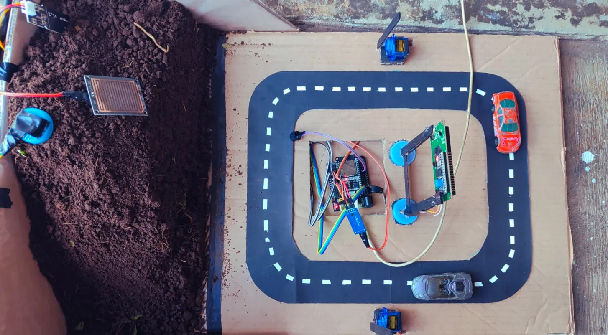

# 🏔️ Landslide Early Warning System

<div align="center">



**An IoT-based early warning system to detect and predict landslide risks using advanced sensor monitoring and real-time data analysis.**

[](LICENSE)
[](https://platformio.org/)
[](https://firebase.google.com/)
[](https://reactjs.org/)

</div>

## Description

The Landslide Early Warning System is a comprehensive IoT solution designed to monitor environmental conditions that could lead to landslides. The system uses multiple sensors to collect real-time data on ground vibration, soil moisture, and rainfall levels. This data is processed using advanced algorithms to assess landslide risk and automatically alert authorities and residents through multiple communication channels.

**Developed by Informatics Engineering students from Institut Teknologi Sumatera (ITERA) as part of their final project on Embedded System in 2025.**

### Key Features

-   🔍 **Real-time Monitoring**: Continuous sensor data collection and analysis
-   ⚡ **Multi-sensor Integration**: MPU6050 accelerometer/gyroscope, SW-420 vibration sensor, soil moisture, and rain sensors
-   🌐 **Web Dashboard**: Modern React-based interface for data visualization
-   📱 **Telegram Alerts**: Instant notifications for emergency situations
-   🔔 **Multi-level Alerts**: Aman (Safe), Awas (Watch), Waspada (Alert) status levels

## Hardware Requirements

### Essential Components

| Component                   | Model/Type            | Quantity | Purpose                          |
| --------------------------- | --------------------- | -------- | -------------------------------- |
| **Microcontroller**         | ESP32 DevKit v1       | 1        | Main processing unit             |
| **Expansion Board**         | ESP32 Expansion Board | 1        | Easy prototyping and connections |
| **Accelerometer/Gyroscope** | MPU6050               | 1        | Ground movement detection        |
| **Vibration Sensor**        | SW-420                | 1        | Vibration and shock detection    |
| **Soil Moisture Sensor**    | Capacitive/Resistive  | 1        | Soil saturation monitoring       |
| **Rain Sensor**             | YL-83 or similar      | 1        | Precipitation detection          |
| **LCD Display**             | 16x2 I2C LCD          | 1        | Local status display             |
| **Servo Motors**            | SG90                  | 2        | Alert mechanism actuators        |
| **Buzzer**                  | Active buzzer         | 1        | Audio alarm                      |

### Wiring Connections

```
ESP32 Pin Layout (using Expansion Board):
├── GPIO 21 (SDA) → MPU6050 SDA, LCD SDA
├── GPIO 22 (SCL) → MPU6050 SCL, LCD SCL
├── GPIO 35 → Rain Sensor (Analog)
├── GPIO 33 → Soil Moisture Sensor (Analog)
├── GPIO 32 → SW-420 Vibration Sensor (Digital)
├── GPIO 18 → Servo Motor 1 Signal
├── GPIO 19 → Servo Motor 2 Signal
├── GPIO 23 → Buzzer
├── 3.3V → Sensors VCC (MPU6050, SW-420)
├── 5V   → Servo Motors, LCD VCC
└── GND  → Common Ground (All components)
```

## 💻 Software Requirements

### Development Environment

-   **PlatformIO**: IoT development platform
-   **Visual Studio Code**: Recommended IDE
-   **Git**: Version control

### Backend Requirements

-   **Python**: 3.8 or higher
-   **Firebase Admin SDK**: Cloud database
-   **APScheduler**: Task scheduling
-   **python-telegram-bot**: Telegram integration

### Frontend Requirements

-   **Bun**: JavaScript runtime and package manager
-   **React**: 18.x
-   **TypeScript**: 5.x
-   **Vite**: Build tool
-   **Tailwind CSS**: Styling framework
-   **Radix UI**: Component library

### Cloud Services

-   **Firebase Realtime Database**: Real-time data storage
-   **Firebase Firestore**: Historical data storage
-   **Telegram Bot API**: Alert notifications

## Hardware Installation

### 1. Circuit Assembly

1. **Prepare the ESP32**: Ensure your ESP32 DevKit v1 is functional
2. **Connect Sensors**:
    ```
    MPU6050:  VCC→3.3V, GND→GND, SDA→GPIO21, SCL→GPIO22
    SW-420:   VCC→3.3V, GND→GND, DO→GPIO32
    Rain:     VCC→3.3V, GND→GND, AO→GPIO35
    Soil:     VCC→3.3V, GND→GND, AO→GPIO33
    LCD:      VCC→5V,   GND→GND, SDA→GPIO21, SCL→GPIO22
    ```
3. **Connect Actuators**:
    ```
    Servo 1:  VCC→5V, GND→GND, Signal→GPIO18
    Servo 2:  VCC→5V, GND→GND, Signal→GPIO19
    Buzzer:   VCC→3.3V, GND→GND, Signal→GPIO23
    ```

### 2. Sensor Calibration

1. **Soil Moisture**: Place in dry soil, note reading; place in wet soil, note reading
2. **Rain Sensor**: Test with water drops to verify sensitivity
3. **MPU6050**: Ensure flat, stable mounting for accurate readings
4. **SW-420**: Test vibration sensitivity and adjust potentiometer if needed

## Software Installation

### 1. Clone Repository

```bash
git clone https://github.com/yourusername/landslide-early-warning-system.git
cd landslide-early-warning-system
```

### 2. ESP32 Firmware Setup

#### Prerequisites

```bash
# Install PlatformIO CLI
pip install platformio

# Or install PlatformIO IDE extension in VS Code
```

#### Configuration

1. **Copy configuration template**:

    ```bash
    cd esp32/include
    cp config.h.example config.h
    ```

2. **Update credentials** in `esp32/include/config.h`:

    ```cpp
    // WiFi Configuration
    const char* WIFI_SSID = "YOUR_WIFI_SSID";
    const char* WIFI_PASSWORD = "YOUR_WIFI_PASSWORD";

    // Firebase Configuration
    const char* FIREBASE_HOST = "https://your-project-default-rtdb.region.firebasedatabase.app";
    const char* FIREBASE_AUTH = "your_firebase_auth_token";

    // Telegram Configuration
    const char* TELEGRAM_BOT_TOKEN = "your_telegram_bot_token";
    const char* TELEGRAM_CHAT_ID = "your_telegram_chat_id";
    ```

#### Build and Upload

```bash
cd esp32
pio run --target upload
pio device monitor
```

### 3. Backend Setup

#### Install Dependencies

```bash
cd backend
pip install -r requirements.txt
```

#### Firebase Configuration

1. Create a Firebase project at [Firebase Console](https://console.firebase.google.com/)
2. Download `serviceAccountKey.json` and place in `backend/` directory
3. **Copy and configure environment variables**:
    ```bash
    cp .env.example .env
    # Edit .env with your actual Firebase credentials
    ```

#### Run Backend

```bash
python index.py
```

Or use the provided batch file:

```bash
start_backend.bat
```

### 4. Frontend Setup

#### Install Bun (if not already installed)

```bash
# Windows (PowerShell)
powershell -c "irm bun.sh/install.ps1 | iex"

# Or download from https://bun.sh/
```

#### Install Dependencies and Run

```bash
cd website
bun install
bun run dev
```

Or use the provided batch file:

```bash
start_frontend.bat
```

### 5. Configure Telegram Bot (Optional)

1. Create a bot via [@BotFather](https://t.me/botfather)
2. Get bot token and update `backend/telegram_bot.py`
3. Add authorized chat IDs for alert recipients

## Usage

### System Startup

1. **Power on ESP32**: The device will connect to WiFi and initialize sensors
2. **Start Backend**: Run the Python backend to handle data processing
3. **Launch Dashboard**: Access the web interface at `http://localhost:5173`

### Monitoring Interface

-   **Real-time Dashboard**: View live sensor readings and system status
-   **Alert Levels**:
    -   🟢 **Aman (Safe)**: Normal conditions
    -   🟡 **Awas (Watch)**: Elevated risk, monitor closely
    -   🔴 **Waspada (Alert)**: High risk, immediate action required

### Data Simulation (Testing)

```bash
cd scripts
pip install -r requirements.txt

# Test all risk levels
python simulate_data.py --mode test

# Continuous alert simulation
python simulate_data.py --risk waspada --mode continuous --duration 300
```

## 🤝 Contributors

**Informatics Engineering Students - Class of 2022**  
**Institut Teknologi Sumatera (ITERA)**

| Student ID    | Name                           | Role                              |
| ------------- | ------------------------------ | --------------------------------- |
| **122140122** | **Alfajar**                    | Project Lead & System Integration |
| **122140155** | **Rustian Afencius Marbun**    | Hardware Engineer                 |
| **122140141** | **Joshua Palti Sinaga**        | Frontend & Backend Developer      |
| **122140137** | **Ikhsannudin Lathief**        | Firmware Developer                |
| **122140189** | **Muhammad Ghiffari Iskandar** | Firmware Developer                |

## Project Structure

```
landslide-early-warning-system/
├── 📁 esp32/
│   ├── 📁 src/
│   ├── 📁 include/
│   ├── 📁 lib/
│   └── platformio.ini
├── 📁 backend/
│   ├── index.py
│   ├── firebase_config.py
│   ├── telegram_bot.py
│   └── requirements.txt
├── 📁 website/
│   ├── 📁 src/
│   ├── 📁 components/
│   └── package.json
├── 📁 scripts/
│   └── simulate_data.py
├── start_backend.bat
├── start_frontend.bat
└── README.md
```

## Configuration

### Environment Variables Setup

**⚠️ IMPORTANT: All credentials are now stored in environment variables for security. Never commit real credentials to version control.**

#### 1. Backend Configuration

1. **Copy environment template**:

    ```bash
    cd backend
    cp .env.example .env
    ```

2. **Edit `.env` file** with your actual credentials:

    ```env
    # Firebase Configuration
    FIREBASE_API_KEY=your_actual_api_key
    FIREBASE_AUTH_DOMAIN=your-project.firebaseapp.com
    FIREBASE_DATABASE_URL=https://your-project-default-rtdb.region.firebasedatabase.app
    FIREBASE_PROJECT_ID=your-project-id
    FIREBASE_STORAGE_BUCKET=your-project.firebasestorage.app
    FIREBASE_MESSAGING_SENDER_ID=your_sender_id
    FIREBASE_APP_ID=your_app_id
    FIREBASE_MEASUREMENT_ID=your_measurement_id

    # Telegram Bot Configuration
    TELEGRAM_BOT_TOKEN=your_telegram_bot_token
    TELEGRAM_CHAT_ID=your_telegram_chat_id
    ```

#### 2. Frontend Configuration

1. **Copy environment template**:

    ```bash
    cd website
    cp .env.example .env
    ```

2. **Edit `.env` file** with your Firebase credentials:
    ```env
    # All variables must have VITE_ prefix for Vite
    VITE_FIREBASE_API_KEY=your_actual_api_key
    VITE_FIREBASE_AUTH_DOMAIN=your-project.firebaseapp.com
    VITE_FIREBASE_DATABASE_URL=https://your-project-default-rtdb.region.firebasedatabase.app
    VITE_FIREBASE_PROJECT_ID=your-project-id
    VITE_FIREBASE_STORAGE_BUCKET=your-project.firebasestorage.app
    VITE_FIREBASE_MESSAGING_SENDER_ID=your_sender_id
    VITE_FIREBASE_APP_ID=your_app_id
    VITE_FIREBASE_MEASUREMENT_ID=your_measurement_id
    ```

#### 3. ESP32 Configuration

1. **Copy configuration template**:

    ```bash
    cd esp32/include
    cp config.h.example config.h
    ```

2. **Edit `config.h` file** with your credentials:

    ```cpp
    // WiFi Configuration
    const char* WIFI_SSID = "Your_WiFi_Name";
    const char* WIFI_PASSWORD = "Your_WiFi_Password";

    // Firebase Configuration
    const char* FIREBASE_HOST = "https://your-project-default-rtdb.region.firebasedatabase.app";
    const char* FIREBASE_AUTH = "your_firebase_auth_token";

    // Telegram Configuration
    const char* TELEGRAM_BOT_TOKEN = "your_telegram_bot_token";
    const char* TELEGRAM_CHAT_ID = "your_telegram_chat_id";
    ```

### Getting Your Credentials

#### Firebase Setup

1. Go to [Firebase Console](https://console.firebase.google.com/)
2. Create a new project or select existing one
3. Go to **Project Settings** → **General** → **Your apps**
4. Add a web app and copy the config values
5. Go to **Project Settings** → **Service accounts**
6. Generate new private key and download `serviceAccountKey.json`
7. Place `serviceAccountKey.json` in the `backend/` directory

#### Telegram Bot Setup

1. Message [@BotFather](https://t.me/botfather) on Telegram
2. Create a new bot with `/newbot` command
3. Save the bot token provided
4. Get your chat ID by messaging [@userinfobot](https://t.me/userinfobot)

### Sensor Thresholds

Modify thresholds in `esp32/src/logic.cpp`:

```cpp
// Risk assessment thresholds
#define VIBRATION_THRESHOLD_LOW 0.5
#define VIBRATION_THRESHOLD_HIGH 1.0
#define SOIL_MOISTURE_THRESHOLD 70
#define RAIN_THRESHOLD 500
```

## License

This project is licensed under the MIT License - see the [LICENSE](LICENSE) file for details.

## Acknowledgments

-   Thanks to the Arduino and ESP32 community for excellent documentation
-   Firebase team for robust cloud infrastructure
-   Open source contributors for sensor libraries
-   Local authorities for disaster management guidance

---

<div align="center">

**Made with ❤️ for safer communities**

[⭐ Star this repository](https://github.com/yourusername/landslide-early-warning-system) if you found it helpful!

</div>
